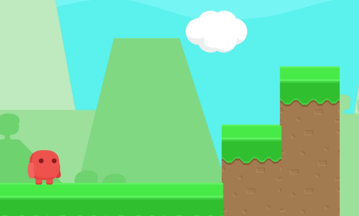
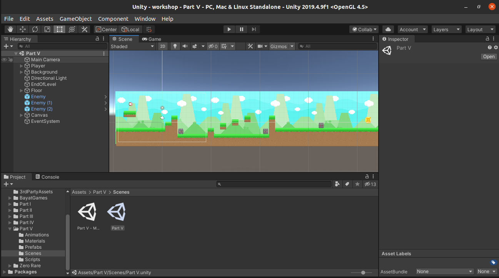

# Animação de Pulo - Revisado

Nesse tutorial, vamos mostrar um passo a passo da criação de uma nova animação no nosso jogo. Você pode replicá-lo para criar outras animações e também melhorar esse tutorial com novas explicações. Fique a vontade!

## Abrindo o projeto

Vamos acessar *Part V* > *Scenes*  e abrir a cena *Part V.* É nela que vamos trabalhar nesse tutorial.

Acesse a pasta *Animations* para ver as animações **Idle** e **Running** que já existem. Elas vão ser nossa inspiração pra criar a animação de **Jumping**!

## Preparando o sprite

Vamos usar o arquivo 1x.png que está na seguinte pasta:

E copiar ele para nossa pasta de *Animations* e dar o nome de *red-person-jumping.png* :

Agora vamos selecionar essa imagem e na aba *Inspector* dizer ao Unity que ela tem *Texture Type* do tipo *Sprite (2D and UI)* e *Sprite Mode* do tipo *Multiple:*

Não vamos esquecer de clicar em *Apply* no *Inspector* pra aplicar essas modificações!

Ainda no *Inspector*, vamos clicar em *Sprite Editor* para abrir a seguinte view chamada *Sprite Editor*:

Nela, clique em *Slice* e depois em *Slice* de novo (rsrs):

O Unity vai adicionar essas bordas brancas em volta de cada parte da nossa imagem, o que quer dizer que poderemos usar elas individualmente para fazer nossa animação:

Agora, na view *Project* quando clicarmos no "Play" que esta presente na imagem, podemos selecionar as duas partes geradas de forma separada:

## Criando animação

No **Player**, crie um *GameObject* vazio e selecione ele:

Agora vamos clicar em ***Window* > *Animation* > *Animation*** e a seguinte view será aberta:

Clicando em ***Create** v*ai abrir uma janela pra gente criar a nova animação com o tempo entre um movimento e outro, e depois salve na pasta *Animations* com o nome de *RedPersonJumping.anim* (ou qualquer nome que quiser).

Lembra que fizemos o *Slice* da nossa imagem pra poder usar cada parte separada? É aqui que vamos usar, arraste separadamente cada imagem pro espaço com linhas e números que tem na view de *Animation*:

Aqui podemos alterar algumas coisas como: o tempo da animação, intervalo entre uma imagem e outro, etc.

Agora a nossa nova animação já tá disponível pra uso e podemos excluir o *GameObject* vazio que criamos junto com *GameObject.controller* que foi gerado, pois não vamos usar eles.

Um outro detalhe é que queremos que a animação de pulo ocorra apenas uma vez enquanto o player estiver pulando. Então clique no *RedPersonJumping.anim* e no *Inspector* retire a seleção ***Loop Time**:*

## Associando animação a um estado

Ainda na nossa pasta de *Animations* vamos dar um clique duplo no arquivo *RedPersonAnimator.controller* e ver o estados que já existem no jogo.

Já podemos ver que tem um estado de **Running** e um de **Idle**. Agora vamos colocar nossa animação de Jumping em jogo (hehe).

Ali perto dos retângulos de **Running** e **Indle**, clique com o botão direito em um espaço vazio e selecione ***Create State* > *Empty***.  Podemos ver que foi criado um novo retângulo e podemos dar o nome que quisermos pra ele.

Vamos chamar de **Jumping**:

Como podemos ver, já existem setinhas saindo e entrando nos estados de **Running** e **Idle**, isso significa que existem **transições** entre eles, ou seja, há momentos que queremos que o jogo passe da animação de **Idle** pra animação de **Running** (quando ele começa a correr, por exemplo), e outros que passe de **Running** pra **Idle**. Vamos usar a mesma lógica pro **Jumping.** Quando o jogador clicar pra pular queremos que a animação passe de **Idle** para **Jumping**.

Para criar essas transições, basta clicar com o botão direito em cima do retângulo de onde queremos que a transição saia, selecionar ***Make Transition*** e ligar ao próximo retângulo.

Idle → Jumping:

Jumping → Idle:

No *Inspector* podemos ver a lista de *Transitions* quando selecionamos o retângulo que a gente quer ver mais detalhes.

Como podemos ver no *Inspector* do estado **Jumping**, ele não tem nenhum arquivo associado no campo *Motion.* E é aí que vamos adicionar a **RedPersonJumping.anim** que nós criamos:

## Controlando estados

Bem, já criamos nosso estado de **Jumping** e já criamos a transição dele para **Idle** e de **Idle** para **Jumping**. Mas como o jogo vai saber quando deve fazer a transição de um estado para outro? Simples, através de **parâmetos**.

Na aba *Parameters* da view *Animator*, podemos ver que já existe um parâmetro chamado **Running**, e é ele que está ditando a transição de estado entre **Idle** e **Running**.

Então vamos criar nosso parâmetro **Jumping** clicando no **+** em cima da lista de parâmetros e selecionando a opção Bool.

Vamos dar o nome a esse novo parâmetro de **Jumping** e ****associá-lo as nossas *Transitions* como *Conditions* (condições). Para selecionar uma transição, clique na linha branca que ela faz ligação.

Queremos fazer a transição do estado *Idle* para *Jumping* quando o parâmetro **Jumping** for verdadeiro (quando o player estiver pulando). Então clicamos no **+** abaixo de *Conditions* e selecionamos **Jumping | true** assim:

E vice-versa:

No *Settings* das *Transitions* por hora vamos deixar dessa forma:

Mas dá pra brincar um pouco com essa parte e deixar as transições melhores.

## Controlando os parâmetros no script

A partir de agora poderemos dar valores ao parâmetro **Jumping** ao acessar o GameObject *Animator* no nosso script de movimentação do player.

Para ficar mais claro, vamos nos basear no que já existe para o parâmetro **Running**.

Se abrirmos o script *PlayerMovimentation.cs* que já existe na nossa pasta *Scripts v*amos ver que existe uma referência ao *Animator* nos atributos públicos do script:

E que em um certo ponto do script, existe um controle para verificar se o player está correndo e assim dar o valor de verdadeiro ou falso para o parâmetro **Running** do ***Animator**:*

Vamos fazer algo semelhante e dar valor ao nosso parâmetro **Jumping** que a gente criou na view *Animator* de acordo com o valor de **isJumping** (está pulando) existente no script. No método **Update()** do script vamos adicionar a seguinte linha:

Agora podemos testar se nossa animação está acontecendo quando clicamos pro Player pular e ir ajustando as transições e outros detalhes pra deixar a animação ainda mais legal!